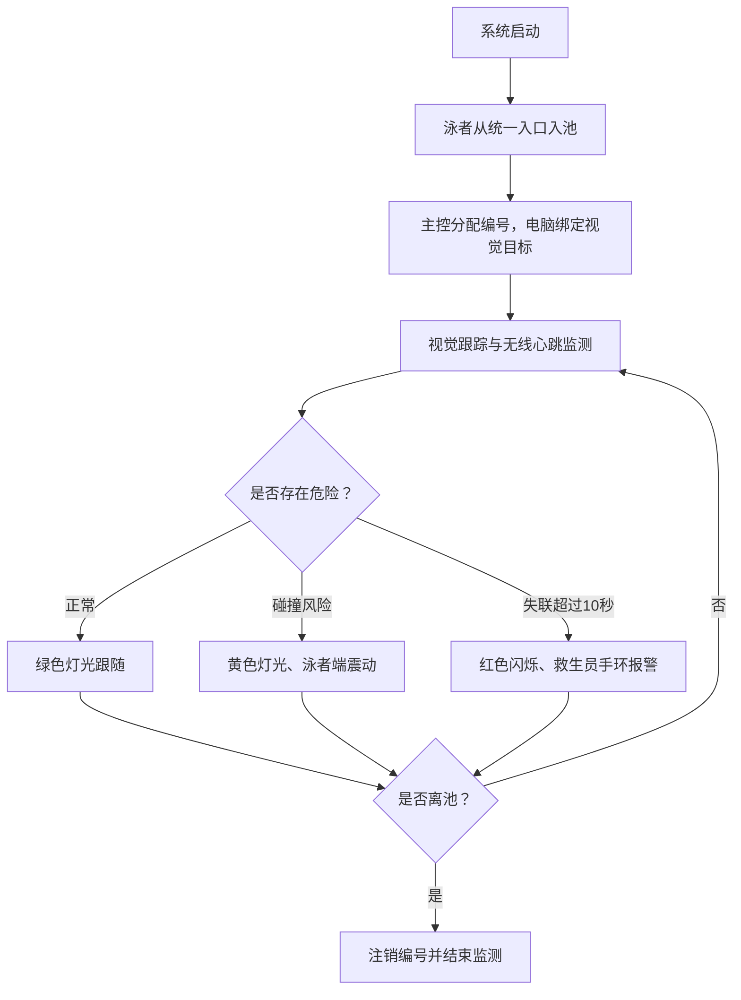

# 冠影守望者——泳池智能安全防护系统（简化版）

## 一、项目简介

“冠影守望者”是一套针对泳池碰撞和溺水事故设计的智能安全防护系统。

系统利用泳池正上方的摄像头识别并跟踪泳者，通过历史位置计算泳者的速度、方向和运动轨迹，提前判断泳者之间是否存在碰撞风险。同时，每名泳者佩戴 ESP32 设备并每隔 1 秒发送一次无线心跳信号。当主控连续超过 10 秒没有收到某名泳者的信号时，系统将其判定为存在溺水风险。

发生危险后，系统通过泳者端震动、池底 RGB 灯带和救生员手环进行多级报警，帮助泳者及时避让，并帮助救生员快速找到疑似溺水者。泳者端还可以扩展简化的自动充气肩颈装置，在连续失联超过 10 秒后为泳者提供辅助浮力，为救援争取时间。

---

## 二、系统组成

系统主要由五部分组成。

### 1. 电脑与顶部摄像头

摄像头安装在泳池正上方，以俯视角度获取整个泳池的实时画面。

电脑负责：

- 使用 OpenCV 检测泳帽；
- 使用 YOLOv8 检测人体；
- 融合泳帽和人体检测结果，确定泳者位置；
- 持续跟踪每名泳者；
- 根据历史位置计算速度、方向和运动轨迹；
- 预测未来数秒内泳者是否会进入危险距离；
- 将泳者位置和碰撞预警发送给 ESP32 主控。

### 2. ESP32 主控

ESP32 主控是整个系统的通信与报警中心，负责：

- 接收泳者端的入池和离池声明；
- 为入池泳者分配编号；
- 接收每名泳者每隔 1 秒发送的心跳信号；
- 为每名泳者分别进行 10 秒失联计时；
- 超过 10 秒未收到信号时触发溺水报警；
- 接收电脑发送的位置和碰撞预警；
- 向泳者端发送碰撞提醒；
- 控制池底 RGB 灯带；
- 向救生员手环发送溺水者所在泳道。

电脑与主控可以通过串口或 Wi‑Fi 连接，最终方式待确定。主控、泳者端和救生员手环之间使用 Wi‑Fi 通信。

### 3. ESP32 泳者端

每名泳者佩戴一个 ESP32 泳者端。

泳者端负责：

- 在统一入口处发送入池声明；
- 接收主控分配的泳者编号；
- 入池后每隔 1 秒发送一次心跳信号；
- 接收主控发送的碰撞预警；
- 发生碰撞风险时控制震动模块提醒泳者；
- 每次发送心跳后接收主控确认，并在本地记录连续失联时间；
- 连续超过 10 秒未收到主控确认时，控制自动充气肩颈装置；
- 从统一出口离池时发送离池声明。

水体会明显衰减 2.4 GHz 无线信号。当泳者持续下沉时，主控可能无法继续收到心跳信号，因此可以利用连续失联时间辅助判断溺水风险。

#### 简化自动充气肩颈装置

为了在救生员到达前减缓泳者继续下沉，泳者端可以安装简化的自动充气肩颈装置。该装置不增加新的溺水检测传感器，继续使用原有的“连续失联超过 10 秒”判断逻辑。

泳者端每隔 1 秒发送心跳信号，主控收到后回复确认。当泳者端连续超过 10 秒没有收到主控确认时，本地 ESP32 控制执行机构触发 CO₂ 充气头，使肩颈气囊快速充气并提供辅助浮力。主控同时按照原有逻辑开启红色灯光和救生员手环报警。

自动充气部分只保留以下必要部件：

| 部件 | 作用 | 参考成本 |
| --- | --- | --- |
| 一体式肩颈气囊 | 充气后提供辅助浮力 | 100～250 元 |
| 胸背固定带 | 固定气囊，防止充气后脱落 | 20～50 元 |
| CO₂ 气瓶 | 提供快速充气气体 | 15～40 元 |
| 配套充气头 | 刺穿气瓶并向气囊充气 | 80～200 元 |
| 防水舵机或推拉电磁铁 | 接收 ESP32 指令并触发充气头 | 30～80 元 |
| 简单连接支架 | 固定执行机构和充气头，可使用 3D 打印制作 | 10～30 元 |

自动充气部分预计成本为 255～650 元。ESP32、锂电池和震动模块直接复用原有泳者端，不重复计算。

其最简工作过程为：

```text
泳者端连续失联超过 10 秒
→ ESP32 驱动防水舵机或推拉电磁铁
→ 执行机构触发 CO₂ 充气头
→ 肩颈气囊快速充气
→ 为泳者提供辅助浮力
```

科创展示阶段使用配重假人进行自动充气和上浮实验，不将自制装置直接用于真人救生。

### 4. 池底 RGB 灯带

每条泳道沿泳池长度方向纵向铺设 RGB 灯带，灯光跟随泳者位置移动。

| 灯光 | 含义 |
| --- | --- |
| 绿色 | 泳者状态正常，显示当前位置 |
| 黄色 | 两名泳者存在碰撞风险 |
| 红色高频闪烁 | 某名泳者存在溺水风险 |

灯光优先级为：

> 红色溺水报警 > 黄色碰撞预警 > 绿色正常提示

### 5. 救生员手环

救生员手环通过 Wi‑Fi 接收主控发送的报警信息。

发生溺水风险时，手环会：

- 震动；
- 蜂鸣报警；
- 在屏幕上显示疑似溺水者所在泳道；
- 可同时显示泳者编号。

---

## 三、泳者编号与身份绑定

系统设置统一入池入口和统一离池出口。

### 入池流程

1. 泳者在统一入口发送入池声明；
2. ESP32 主控为泳者分配编号；
3. 主控将编号发送给电脑；
4. 电脑在入口区域寻找新出现的泳帽和人体目标；
5. 电脑将该目标与泳者编号绑定；
6. 泳者入池后，视觉系统持续跟踪该目标，防止编号丢失；
7. 主控开始监测该泳者的心跳信号。

系统形成以下对应关系：

```text
泳者端设备 ID ↔ 主控分配的泳者编号 ↔ 电脑中的视觉轨迹 ID
```

### 离池流程

1. 泳者从统一出口离开；
2. 泳者端发送离池声明；
3. 主控停止该泳者的心跳监测；
4. 电脑结束对应目标的有效跟踪；
5. 主控清除该泳者的灯光和报警状态。

---

## 四、系统运行逻辑



### 1. 系统启动

电脑启动视觉程序并加载 OpenCV 参数和 YOLOv8 模型；ESP32 主控、泳者端和救生员手环连接网络；主控初始化 RGB 灯带并进入等待状态。

### 2. 正常监测

泳者入池后，两套监测逻辑同时运行：

- 电脑持续识别泳帽和人体，计算泳者的位置、速度和方向；
- 泳者端每隔 1 秒向主控发送心跳信号；
- 主控根据电脑提供的位置控制绿色灯珠跟随泳者。

### 3. 碰撞预警

电脑根据每名泳者的历史轨迹预测未来数秒内的位置。预测时间和安全距离均可以配置。

如果两名泳者的预测轨迹将在未来进入安全距离：

1. 电脑向主控发送碰撞预警；
2. 主控向相关泳者端发送提醒；
3. 泳者端震动，提醒泳者避让；
4. 两名泳者附近的灯光由绿色变为黄色；
5. 风险解除后，灯光恢复绿色。

### 4. 溺水预警

主控分别记录每名泳者最后一次发送心跳的时间。

如果某名泳者连续超过 10 秒没有有效通信：

1. 主控将其判定为存在溺水风险；
2. 泳者端本地计时达到 10 秒后，触发自动充气肩颈装置；
3. 主控获取电脑最近一次上报的位置和泳道；
4. 对应位置的灯带红色高频闪烁；
5. 救生员手环震动并蜂鸣；
6. 手环屏幕显示疑似溺水者所在泳道。

当该泳者重新发送稳定心跳后，系统可以自动解除报警；主控也支持人工确认或解除。

如果碰撞和溺水报警同时出现，优先执行溺水报警，并使用红色高频闪烁。

### 5. 离池注销

泳者从统一出口离开并发送离池声明后，主控停止心跳计时，电脑结束该编号的有效视觉跟踪，灯带和报警状态被清除。

---

## 五、项目特点

1. **双重监测**  
   视觉系统负责判断泳者的位置和运动状态，无线心跳负责监测泳者是否持续失联。

2. **融合识别**  
   OpenCV 检测泳帽，YOLOv8 检测人体，二者共同确定泳者位置。

3. **提前预测碰撞**  
   系统不是只判断当前距离，而是根据速度和方向预测未来轨迹。

4. **身份持续绑定**  
   通过统一入口、主控编号和视觉跟踪保持泳者身份，避免多人场景下编号混乱。

5. **多级报警**  
   泳者端震动用于碰撞提醒，RGB 灯带用于现场定位，救生员手环用于溺水报警。

6. **报警位置直观**  
   池底灯光直接显示危险发生的泳道和大致位置，有助于救生员快速处置。

7. **主动浮力辅助**  
   在原有连续失联判断逻辑基础上，泳者端可以触发简化的自动充气肩颈装置，在救生员到达前减缓继续下沉，为救援争取时间。

---

## 六、总结

“冠影守望者”通过顶部摄像头、计算机视觉、ESP32 无线设备、池底 RGB 灯带和救生员手环，建立了一套完整的泳池安全防护系统。

电脑负责识别泳者、跟踪位置并预测碰撞；ESP32 主控负责心跳监测、风险判断和设备联动；泳者端负责发送心跳和接收震动提醒；RGB 灯带通过绿、黄、红三种状态显示泳者位置和危险等级；救生员手环负责及时发出溺水报警。

系统能够形成“实时监测—风险判断—现场提示—主动浮力辅助—人员报警”的安全闭环，为泳池碰撞预防和溺水救援提供辅助支持。
