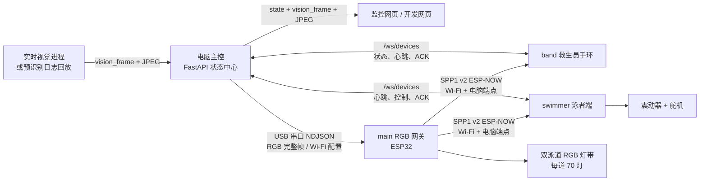

# 冠影守望者项目全面介绍

> 文档基准日期：2026-08-14
> 开发目录：`D:\Vibecoding Projects\SPPer`；展示副本可放在任意磁盘目录
> 统一数据规范：[DATA_INTERFACE_SPEC.md](./DATA_INTERFACE_SPEC.md)

## 1. 项目概述

“冠影守望者”是一套面向双泳道泳池场景的智能安全防护原型。系统以电脑为主控，
将视觉画面、泳者位置、碰撞风险、穿戴设备通信状态、RGB 灯带、救生员手环和泳者端
救生装置统一接入一个状态中心。

项目的核心设计原则是：尽可能把计算、状态协调、可靠重试、演示回放和人工控制放在
电脑端完成，嵌入式设备只保留必要的实时安全逻辑和硬件执行能力。

当前系统可以完成：

- 接收实时视觉识别结果和 JPEG 画面；
- 直接回放已经生成的识别日志，无需重新运行视觉模型；
- 将泳者映射到两条泳道和每条泳道 1～70 号 RGB 灯；
- 显示正常、碰撞、疑似溺水和高风险状态；
- 通过 ESP-NOW 为救生员手环和泳者端下发 Wi-Fi 与电脑地址；
- 监测泳者端心跳，在 10 秒和 20 秒阈值执行分级安全响应；
- 为碰撞预警提供泳者端振动提醒；
- 通过带确认的网页按钮手动触发实体救生装置；
- 可靠复位已经锁存的实体救生状态；
- 使用虚拟泳者和预识别视频进行完整演示与联调。

当前移动展示版将视觉模型与运行系统解耦：不携带 `yolo/`，只携带约 118 MB 的
原视频、逐帧 JSONL 和摘要。OpenCV 在 CPU 上按时间戳解码并驱动同一套状态、灯光、
手环和泳者端联动，因此笔记本无需 CUDA 或独立显卡。

## 2. 当前版本

| 部件 | 当前版本 | 主要平台 | 权威目录 |
| --- | --- | --- | --- |
| 电脑端后台 API | `0.2.0` | Python、FastAPI、Uvicorn | `computer/backend/` |
| 电脑端网页包 | `0.1.0` | Next.js 16、React 19、TypeScript | `computer/app/` |
| RGB 硬件网关 | `0.3.3` | ESP32 | `main/` |
| 救生员手环 | `0.3.1` | HU-087、ESP32-S3 | `band/` |
| 泳者安全终端 | `0.5.4` | ESP32-C3 | `swimmer/` |
| 数据接口文档 | `1.2` | Markdown | `DATA_INTERFACE_SPEC.md` |
| 业务消息结构 | `schema_version = 1.0` | JSON / WebSocket / NDJSON | 全系统 |
| 无线配网广播 | `SPP1 v2` | ESP-NOW，116 字节 | `main/`、`band/`、`swimmer/` |

说明：`main` 是当前 RGB 网关固件目录，`band` 是当前救生员手环固件目录，
`swimmer` 是当前泳者端固件目录。`swimmer_backups/` 为历史备份，不应作为当前版本修改。

## 3. 总体架构



### 3.1 电脑端是状态主控

电脑负责：

- 汇总视觉、虚拟泳者和穿戴设备状态；
- 维护泳者、设备、配对、碰撞和报警状态；
- 完成泳道与灯号映射；
- 生成 RGB 灯带完整帧；
- 向救生员手环发布完整安全快照；
- 向泳者端可靠发送振动、救生触发和复位命令；
- 保存 ROI 标定；
- 运行演示视频状态机；
- 在网页提供统一控制入口。

### 3.2 嵌入式设备保留本地安全能力

泳者端不会完全依赖电脑做安全计时。注册成功后，它按照心跳 ACK 独立计算通信失联：

- 10 秒没有有效状态同步：进入疑似溺水，启动高频振动；
- 20 秒没有有效状态同步：若允许自动救生，则锁存救生状态并启动舵机；
- 报警后必须连续收到 3 个不同消息 ID 的正确心跳 ACK 才恢复通信正常；
- 已经锁存的救生状态不会因为重连或恢复心跳自动清除。

## 4. 目录结构

```text
SPPer/
├─ computer/                  电脑端网页、后台、测试和静态构建
│  ├─ app/                   Next.js 监控页和开发页
│  ├─ backend/               FastAPI、状态、设备、灯光、串口、回放
│  ├─ tests_python/          电脑端自动化测试
│  ├─ data/settings.json     ROI 等持久化设置（运行时生成）
│  └─ out/                   Next.js 静态构建输出
├─ main/                     双泳道 RGB 网关固件
├─ band/                     HU-087 救生员手环固件及音频资源
├─ swimmer/                  ESP32-C3 泳者端固件
├─ swimmer_backups/          泳者端历史版本备份
├─ demo_assets/
│  └─ vision_replays/        四组原视频、逐帧JSONL和摘要（仅CPU回放）
├─ scripts/                  笔记本安装、启动与验收脚本
├─ DATA_INTERFACE_SPEC.md    全系统正式数据接口规范
├─ 笔记本部署与演示指南.md       可移动硬盘部署与现场操作
├─ guanying_shouwangzhe_simplified(1).md
│                             早期简化方案/需求背景
└─ 项目全面介绍.md            本文档
```

展示副本不包含 `yolo/`、Git历史、虚拟环境、Node依赖和构建缓存。`board/`、
`deliverables/` 等属于说明与交付资料；`.codex_board_work/` 不参与运行。

## 5. 电脑端

### 5.1 技术栈

- Python 3.11 或更高版本；
- FastAPI、Uvicorn、Pydantic；
- PySerial，用于 RGB 网关自动串口探测；
- OpenCV Headless，用于原视频逐帧解码和 JPEG 编码；
- Next.js 16.2.12、React 19.2.6、TypeScript 5.9；
- 网页静态导出后由同一个 Python 进程提供。

### 5.2 后台文件职责

| 文件 | 职责 |
| --- | --- |
| `computer/backend/main.py` | FastAPI 入口、REST/WebSocket 路由、模块协调 |
| `computer/backend/state.py` | 泳者、碰撞、报警、视觉帧和标定状态中心 |
| `computer/backend/devices.py` | 手环/泳者设备会话、心跳、ACK、可靠控制、配对 |
| `computer/backend/serial_gateway.py` | 串口枚举、网关握手、RGB 帧和 Wi-Fi 配置 |
| `computer/backend/lighting.py` | 泳道/灯号映射、颜色优先级和 RGB 帧合成 |
| `computer/backend/vision_replay.py` | 四组视频与 JSONL 的同步回放、事件暂停 |
| `computer/backend/models.py` | Pydantic 数据结构与字段校验 |
| `computer/backend/settings.py` | 本地设置持久化 |

### 5.3 网页功能

监控页 `/` 提供：

- 视觉画面、识别框、泳道边界和灯号；
- 四组预识别视频选择与播放控制；
- 正常、碰撞、疑似溺水、高风险统计；
- 事件提示卡和自动暂停；
- 泳者端振动联动开关；
- 始终可见的“触发救生装置”和“复位救生装置”按钮；
- 多台泳者设备在线时的目标设备选择；
- 实体救生触发确认提示。

开发页 `/dev/` 提供：

- 虚拟泳者增删、位置和状态调试；
- 设备列表和设备详细状态；
- 拖拽式一对一配对窗口；
- 每个配对的自动救生允许/禁止设置；
- 模拟下沉（停止泳者端业务心跳，而不是直接制造报警）；
- 碰撞调试；
- RGB 网关串口、Wi-Fi 与状态调试。

识别框只显示 ID 和风险文字，不显示置信度百分比。

## 6. 视觉输入与回放

### 6.1 实时视觉接口

实时视觉进程连接：

```text
ws://<电脑IP>:8000/ws/vision
```

每帧严格依次发送：

1. `vision_frame` JSON 元数据；
2. 对应 JPEG 二进制。

网页通过 `/ws/dashboard` 接收状态、视觉元数据和 JPEG。当前系统是单视觉源状态模型，
不应同时向 `/ws/vision` 推送多路相互覆盖的摄像头数据。

### 6.2 预识别视频

电脑直接读取原始 H.264 视频和对应的逐帧 JSONL，不重新运行 YOLO，也不使用已经
画框的视频作为网页输入。网页在原始画面上根据 JSONL 绘制识别框。

| 样本 | 帧数 | FPS | 人数 | 碰撞 episode | 用途 |
| --- | ---: | ---: | ---: | ---: | --- |
| `oneline` | 453 | 30 | 1 | 0 | 单人泳道与灯号映射 |
| `twolines` | 525 | 30 | 2 | 0 | 双人正常通行 |
| `crashing` | 246 | 30 | 2 | 1 | 碰撞预警演示 |
| `drowning` | 717 | 30 | 1 | 0 | 疑似溺水与高风险演示 |

### 6.3 回放事件暂停

`crashing`：

- 第 125 帧：处理碰撞 START 后自动暂停；
- 暂停和继续播放期间保持黄色状态与泳者端振动；
- 第 166 帧：先解除黄色状态和振动，再显示“碰撞预警结束”并自动暂停。

`drowning`：

- 第 335 帧：自动暂停，提示“连续 10 秒未检测到有效信号，判断疑似溺水”；
- `vision-1` 进入 `suspected_drowning`；
- RGB 红色闪烁、救生员手环预警、泳者端持续振动；
- 明确标记“救生装置未触发”；
- 第 490 帧：升级为 `high_risk / drowning` 并再次自动暂停；
- 提示已经达到救生条件，但演示仍不下发真实救生信号；
- 视频播放到结尾后保持高风险，直到停止、切换、重播或成功复位。

暂停只是冻结视频时间轴，不额外启动升级计时器，停留多久都不会自动跨越下一个节点。

### 6.4 自动配对规则

- 回放期间恰好只有一台在线泳者设备时，电脑自动将其绑定到 `vision-1`；
- 多台设备在线时不猜测目标，并清除自动绑定，等待人工配对；
- `vision-2` 可以只存在于电脑状态和 RGB 映射中；
- 关闭“泳者端振动联动”只禁止泳者端振动，不影响网页、RGB 和救生员手环演示。

## 7. 泳道与 RGB 映射

### 7.1 坐标系

- 画面左上角为 `(0, 0)`；
- 右下角为 `(1, 1)`；
- `x` 向右增加，`y` 向下增加；
- ROI 外的视觉目标不参与灯光投射。

### 7.2 泳道边界

手动标定默认使用 ROI 水平中线。视频回放支持倾斜浮标绳，以左右端点
`lane_boundary_line.left_y/right_y` 描述，并根据泳者横坐标线性插值该位置的边界。

兼容字段 `lane_boundary_y` 始终保留，值为左右端点的中心值。

判断规则：

```text
frame_y < 当前横坐标处的边界  => 泳道 1
其他                             => 泳道 2
```

### 7.3 灯号

每条泳道 70 颗灯，横向映射公式：

```text
led_index = round(clamp(pool_x, 0, 1) × 69) + 1
```

颜色和优先级：

| 状态 | 颜色 | 行为 |
| --- | --- | --- |
| `normal` | 绿色 `00FF00` | 常亮 |
| `collision` | 黄色 `FFD000` | 常亮 |
| `suspected_drowning` | 红色 `FF0000` | 逐帧亮灭 |
| `drowning` | 红色 `FF0000` | 逐帧亮灭 |

优先级：

```text
drowning > suspected_drowning > collision > normal
```

## 8. RGB 网关（main）

### 8.1 硬件

| 功能 | 引脚/参数 |
| --- | --- |
| 泳道 1 WS2812B | GPIO26 |
| 泳道 2 WS2812B | GPIO17 |
| 每条灯带 | 70 灯 |
| 串口 | 115200、UTF-8 NDJSON |
| 默认亮度 | 32 / 255 |

灯带应由独立 5V 电源供电，ESP32、灯带和电源必须共地。

### 8.2 串口发现

电脑不会固定使用某个串口。自动模式会逐个打开可用串口并发送 `gateway_probe`，
只保留返回合法 `gateway_hello` 且声明两条泳道、每道 70 灯的设备。开发页仍可手动
选择串口。

电脑每 200 ms 发送一条完整 `rgb_frame`。网关连续 1500 ms 未收到合法 RGB 帧时
自动熄灭两条灯带。

### 8.3 ESP-NOW 配网广播

网关连接 Wi-Fi 并获得有效电脑端点后广播 `SPP1 v2`：

- 固定 116 字节；
- 包含 SSID、密码、电脑 IPv4 和端口；
- 带 CRC32；
- 每 10 秒启动一次约 2.2 秒的突发广播；
- 突发期间约每 100 ms 发送一次。

Wi-Fi 密码不会进入电脑状态快照或普通日志。

## 9. 救生员手环（band）

当前硬件为 HU-087（ESP32-S3 N16R8）：

| 外设 | 引脚 |
| --- | --- |
| SSD1306 SDA / SCL | GPIO41 / GPIO42 |
| OLED 地址 | `0x3C` |
| I²S DOUT / BCLK / LRCK | GPIO7 / GPIO15 / GPIO16 |
| 功放使能 | GPIO17，高电平有效 |

运行逻辑：

- 每次启动扫描 1～13 信道，等待 `SPP1 v2`；
- 加入指定 Wi-Fi 后连接 `/ws/devices`；
- 注册为 `lifeguard_band`；
- 每 5 秒发送心跳，电脑按 15 秒超时判离线；
- 危险时播放警报音和“泳道一/泳道二/两泳道疑似溺水”语音；
- 危险期间电脑断线时保持最后危险报警；
- 只有收到明确的安全快照才停止声音并关闭功放。

碰撞状态不会触发救生员手环，疑似溺水和高风险会触发。

## 10. 泳者端（swimmer）

### 10.1 硬件

| 功能 | ESP32-C3 引脚 |
| --- | --- |
| 震动模块 IN | GPIO6，高电平有效 |
| 舵机 PWM | GPIO5 |
| 舵机频率 | 50 Hz |
| 0～180° 脉宽 | 600～2600 μs |

舵机必须使用合适的独立电源，并与 ESP32-C3 共地；不要直接用开发板 3V3 为舵机供电。

### 10.2 开机自检

- 震动器连续运行 5 秒；
- 舵机执行 `180° → 90° → 180°`；
- 90° 保持 1 秒；
- 自检是非阻塞状态机，不阻塞无线搜索和通信。

### 10.3 当前救生动作

固件 `0.5.4` 的实体救生序列为：

```text
90° → 0° → 90° → 0° → 90° → 0° → 90° → 0° → 90° → 0° → 90°
```

- 共执行 5 轮 `90° → 0°`；
- 每个角度保持 0.5 秒；
- 五轮完成后再从 0° 回到 90°，最后停在 90°；
- 复位命令会立即取消未完成动作并回到 180°；
- 相同 `message_id` 的电脑重试只重新 ACK，不重复执行动作。

### 10.4 碰撞振动

固件的 `collision_pulse` 是约 250 ms 的短振动作。实时视觉和开发页沿用一次短振语义，
电脑端有 2 秒抑制时间。

视频回放为了维持碰撞演示振动，会等待上一条可靠命令 ACK 完成后，再周期发送新的
短振命令；碰撞 END、停止回放或关闭振动联动后终止续发。

## 11. 实体救生控制与安全边界

监控页始终显示两个按钮：

- **触发救生装置**：在线且空闲的泳者设备可在任何视频状态下手动触发；
- **复位救生装置**：始终显示，但只有设备已确认救生锁存、通信恢复正常、完成
  3 次恢复心跳且没有待处理命令时才启用。

多台泳者设备可选择目标。手动触发不强制要求设备已经与视觉泳者配对；未配对设备
产生的报警会被视为“未定位危险”，电脑会按两条泳道均危险处理。

触发按钮必须经过浏览器确认，提示将真实驱动舵机。视频演示只改变演示状态，
不会自动发送 `trigger_rescue=true`。

停止视频不会暗中复位已经真实锁存的救生装置。只有设备 ACK 成功后，电脑才认为
实体复位完成；复位失败或超时会保留警告和状态。

## 12. 主要接口

### 12.1 WebSocket

| 路径 | 客户端 | 功能 |
| --- | --- | --- |
| `/ws/vision` | 实时视觉进程 | 每帧元数据 + JPEG，返回 `vision_ack` |
| `/ws/dashboard` | 监控页/开发页 | 状态、视觉元数据和 JPEG 广播 |
| `/ws/devices` | 救生员手环、泳者端 | 注册、心跳、状态、控制与 ACK |

### 12.2 常用 REST API

| 方法与路径 | 功能 |
| --- | --- |
| `GET /api/health` | 服务健康状态 |
| `GET /api/state` | 完整系统快照 |
| `GET /api/devices` | 设备连接、心跳、绑定和救生状态 |
| `GET /api/vision/replays` | 回放样本清单 |
| `POST /api/vision/replay/command` | 选择、播放、暂停、重播、停止、振动联动 |
| `PUT /api/devices/{id}/binding` | 绑定泳者设备与泳者 |
| `POST /api/devices/{id}/rescue-trigger` | 可靠手动触发实体救生 |
| `POST /api/devices/{id}/rescue-reset` | 可靠复位实体救生锁存 |
| `GET /api/gateway/status` | RGB 网关与 Wi-Fi 状态 |
| `POST /api/gateway/reconnect` | 重新探测网关 |
| `PUT /api/gateway/port` | 手动串口或恢复自动模式 |
| `POST /api/gateway/wifi` | 配置网关 Wi-Fi |
| `PUT /api/calibration/roi` | 保存视觉 ROI |

会改变硬件或配置的管理接口只允许从服务器本机访问。局域网浏览器主要用于只读监控。

## 13. 安装与启动

### 13.1 电脑端首次安装

```powershell
cd "D:\Vibecoding Projects\SPPer\computer"
python -m venv .venv
.\.venv\Scripts\python.exe -m pip install -r requirements.txt
.\.venv\Scripts\python.exe -m pip install -r requirements-dev.txt
npm install
npm run build:static
```

### 13.2 正式启动

```powershell
cd "D:\Vibecoding Projects\SPPer\computer"
.\.venv\Scripts\python.exe run.py --host 0.0.0.0 --port 8000
```

`run.py` 默认监听地址就是 `0.0.0.0`，建议始终通过它启动。不要只监听
`127.0.0.1`，否则本机网页可用，但手环和泳者端无法通过电脑局域网 IP 连接。

访问地址：

- 本机监控：`http://127.0.0.1:8000/`；
- 局域网监控：`http://<电脑局域网IP>:8000/`；
- 开发页：`http://127.0.0.1:8000/dev/`；
- FastAPI 文档：`http://127.0.0.1:8000/docs`。

Windows 防火墙需要允许 Python 在当前可信网络入站访问 8000 端口。

## 14. 构建与烧录

### 14.1 RGB 网关

```powershell
cd "D:\Vibecoding Projects\SPPer\main"
pio test -e native
pio run -e esp32-c3
pio run -e esp32-c3 -t upload --upload-port COMx
```

### 14.2 救生员手环

```powershell
cd "D:\Vibecoding Projects\SPPer\band"
pio run -e hu-087
pio run -e hu-087 -t upload
```

当前 `platformio.ini` 记录的实验室端口是 COM14。手环需要按照 `band/README.md`
说明进入手动下载模式。

### 14.3 泳者端

```powershell
cd "D:\Vibecoding Projects\SPPer\swimmer"
pio test -e native
pio run -e esp32-c3
pio run -e esp32-c3 -t upload --upload-port COM3
pio device monitor -p COM3 -b 115200
```

当前实验室中 COM3 对应 USB VID `303A`、PID `1001` 的 ESP32-C3。端口可能随电脑
或插拔顺序变化，烧录前仍应重新确认，避免误烧 RGB 网关。

## 15. 测试

电脑端：

```powershell
cd "D:\Vibecoding Projects\SPPer\computer"
.\.venv\Scripts\python.exe -m pytest tests_python -q
npm run lint
npm run build:static
```

当前最近验证结果：

- 电脑端 Python：45 项测试通过；
- 前端 ESLint：通过；
- Next.js 生产静态构建：通过；
- 泳者端 native：13 项测试通过；
- 泳者端 ESP32-C3 编译与当前固件烧录：通过。

自动化测试不得真实触发舵机。实体动作测试只能在确认目标设备、供电和机械安全后
由操作者手动执行。

## 16. 常见故障排查

### 16.1 网页正常，但电脑显示设备为 0

依次检查：

1. 服务是否监听 `0.0.0.0:8000`，而不是只监听 `127.0.0.1:8000`；
2. `http://<电脑局域网IP>:8000/api/health` 是否可访问；
3. `/api/gateway/status` 中 `server_ipv4/server_port` 是否正确；
4. 网关是否 `protocol_ready=true`、Wi-Fi 已连接且广播成功；
5. Windows 防火墙是否允许 Python 入站；
6. 手环和泳者端是否收到 `SPP1 v2` 并连接 `/ws/devices`；
7. `/api/devices` 中是否存在设备、心跳、`last_error` 或超时信息。

### 16.2 RGB 网关未连接

- 查看自动探测是否正在遍历串口；
- 确认波特率为 115200；
- 确认网关固件返回合法 `gateway_hello`；
- 在开发页切换手动串口测试；
- 不要把泳者端 COM3 误选为 RGB 网关。

### 16.3 复位按钮不可用

复位必须同时满足：

- 目标设备在线；
- 设备已上报救生锁存；
- `communication_state=normal`；
- 已完成 3 次恢复心跳；
- 当前没有待处理可靠命令。

这属于安全约束，不应通过前端强制绕过。

### 16.4 页面仍是旧版本

```powershell
cd "D:\Vibecoding Projects\SPPer\computer"
npm run build:static
```

随后重启 Python 服务并刷新浏览器。

## 17. 当前限制与后续扩展

- 当前视觉状态模型是单路视觉源，不支持多摄像头同时覆盖状态；
- 泳池模型固定为两条泳道、每道 70 灯；
- 当前单名泳者只能保存一个 `collision_with`；
- 设备会话、配对和大部分运行状态保存在内存，电脑服务重启后重新建立；
- ROI 会持久化，但回放的自动浮标绳边界只对当前回放有效；
- 预识别视频不依赖实时 YOLO，未来实时视觉模块只需遵守 `/ws/vision` 协议；
- 当前设备连接尚未加入生产级身份认证，只应在可信局域网使用；
- ESP-NOW 配网包按当前原型要求包含明文 Wi-Fi 凭据，只适用于受控展示网络。

视觉模块未来可以独立迭代，只要继续输出稳定的 `track_id`、边界框、归一化中心点和
可选碰撞集合，就不需要修改泳者端固件。新识别逻辑应优先在电脑或视觉进程中完成，
再通过既有状态和设备协议驱动 RGB、手环与泳者端。

## 18. 修改入口速查

| 需求 | 优先修改位置 |
| --- | --- |
| 监控页布局、提示、按钮 | `computer/app/monitor-client.tsx`、`globals.css` |
| 前端状态类型和 WebSocket | `computer/app/system.ts` |
| API、回放协调、硬件动作入口 | `computer/backend/main.py` |
| 设备心跳、配对、可靠命令 | `computer/backend/devices.py` |
| 泳者状态与视觉映射 | `computer/backend/state.py` |
| RGB 颜色和灯号 | `computer/backend/lighting.py` |
| 串口探测与 Wi-Fi 配置 | `computer/backend/serial_gateway.py` |
| 视频样本和事件暂停 | `computer/backend/vision_replay.py` |
| RGB 网关硬件 | `main/src/main.cpp` |
| 救生员手环硬件 | `band/src/main.cpp` |
| 泳者端安全与舵机 | `swimmer/src/main.cpp`、`swimmer/include/` |
| 全系统字段和协议 | `DATA_INTERFACE_SPEC.md` |

## 19. 安全提醒

- 真实触发救生装置会驱动实体舵机，操作前必须确保机构和人员安全；
- 舵机和灯带必须使用独立合适电源并与控制板共地；
- 不要依赖网页演示替代真实硬件安全测试；
- 自动化测试、视频回放和页面验收不得自动触发实体舵机；
- 已锁存救生状态不能通过停止视频或重启页面来当作已经复位；
- 烧录前必须核对串口和 USB 设备身份；
- 修改消息字段前先更新并遵守 `DATA_INTERFACE_SPEC.md`，避免各端协议漂移。
